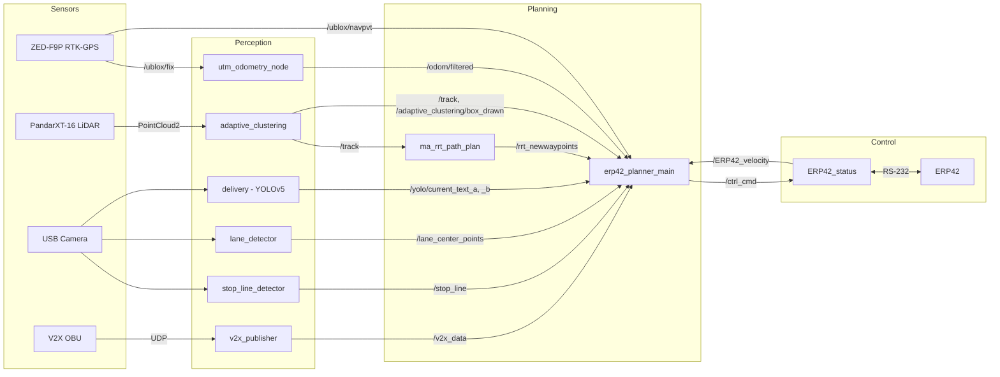
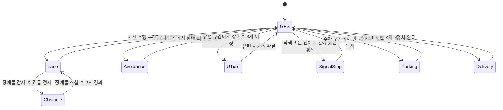

# ERP42 Autonomous Driving Stack


**대학생 창작 모빌리티 경진대회** 출전을 위해 개발한 ERP42 플랫폼 자율주행 소프트웨어입니다.
RTK-GPS 경로 추종을 기본으로, LiDAR 장애물 회피 · V2X 신호 연동 · 주차 · 배달 · 차선/정지선 인식 미션을
하나의 미션 플래너가 모드 전환으로 수행합니다. (팀 NAVIGATOR, 2025 시즌 최종 코드 기준)

> ROS 1 (Noetic) based autonomous driving stack for the ERP42 platform: RTK-GPS waypoint following (pure pursuit + PID),
> LiDAR clustering + RRT obstacle avoidance, SAE J2735 SPaT (V2X) traffic-signal handling, and camera-based
> stop-line / lane / delivery-sign perception, orchestrated by a single mode-switching mission planner.

---

## 시스템 구성

| 구분 | 구성 |
| --- | --- |
| 차량 | ERP42 (RS-232 시리얼 제어, 115200 baud) |
| 측위 | u-blox ZED-F9P RTK-GPS → UTM odometry + NAV-PVT heading |
| LiDAR | Hesai PandarXT-16 |
| 카메라 | USB 카메라 (`usb_cam`) |
| 통신 | V2X OBU (UDP, SAE J2735 SPaT) |
| SW | ROS Noetic / Python 3 / C++ (PCL) / PyTorch |

### 노드 · 토픽 구조



### 미션 플래너 모드 전환

`erp42_planner_main.py`는 20 Hz 루프에서 현재 waypoint 인덱스와 센서 이벤트로 주행 모드를 전환합니다.



---

## 주요 기능

### 1. 경로 추종 제어 — `planning_control/erp42_control_ob`
- **Pure Pursuit**: UTM 전역 경로(`x y 목표속도`)에서 최근접 waypoint 기준 30개 구간을 지역 경로로 잘라 사용하고,
  현재 속도 구간별로 look-ahead distance(1.9 ~ 4.8 m)를 다르게 적용
- **속도 제어**: PID + 1차 저역통과 필터(α = 0.3)로 가속/제동 명령 생성, waypoint마다 목표 속도를 경로 파일에 내장해 곡선 구간 감속
- **차량 인터페이스** (`ERP42_status.py`): ERP42 시리얼 프로토콜(`S T X … 0x0D 0x0A`) 패킷 생성/파싱,
  별도 스레드에서 피드백(속도·조향·기어·엔코더)을 수신해 토픽으로 발행, 주행 로그 CSV 기록

### 2. 미션 플래너 — `erp42_planner_main.py`
- GPS / Lane / Obstacle / U-Turn 모드와 회피 · 신호 정지 · 주차 · 배달 시퀀스를 waypoint 구간 테이블로 관리
- **장애물 회피**: 지정 구간에서 장애물이 감지되면 정지 후 대기 → RRT가 생성한 차량 좌표계 waypoint를 Pure Pursuit로 추종 → 구간 이탈 시 GPS 추종 복귀
- **V2X 신호 대응**: 교차로 ID · signal group을 waypoint에 매핑하고 SPaT의 `event_state`와 잔여 시간(`minEndTime`)으로 정지/통과 판단 (황색은 잔여 1.5 s 기준)
- **주차**: 주차 구간에서 LiDAR 플래그가 연속으로 비어 있음을 확인한 뒤 전진-후진 시퀀스 수행, 후진 중 정지선이 검출되면 정지 후 탈출
- **배달**: 표지판 인식값을 고정 길이 윈도우(deque)로 디바운싱해 A 표지판을 확정하고, 일치하는 B 표지판 위치에서 정차 시퀀스 수행

**미션별 플래너** — 통합 플래너 외에 미션 단위로 검증하던 버전도 함께 둡니다.

| 스크립트 | 내용 |
| --- | --- |
| `erp42_planner_main.py` | 전 미션 통합 플래너 (2025 최종) |
| `erp42_planner_bigob.py` | 대형 장애물 회피: 지정 구간에서 장애물 감지 시 조향 → GPS 추종 → 반대 조향의 3단계 시퀀스, 회피 방향은 장애물마다 교대 (`erp42_bigob.launch`) |
| `erp42_planner_cits.py` | V2X 신호 대응 + 장애물 정지/회피 (waypoint별 교차로 ID · signal group 매핑) |
| `erp42_planner_only_cits.py` | GPS 추종 + V2X 신호 대응만 분리한 버전 |
| `erp42_planner_2024.py` | 2024 대회 버전 (GPS / Lane / Obstacle / U-Turn) |
| `cits_test.py`, `cits_test_multi.py` | SPaT 메시지를 수동 발행하는 신호 대응 테스트용 노드 (단일 / 다중 교차로) |

### 3. LiDAR 장애물 인지 — `perception/adaptive_clustering` *(yzrobot/adaptive_clustering 수정)*
- Voxel grid(0.125 m) 다운샘플링 → x/y/z 및 방위각 ROI 필터 → 거리 구간별 tolerance를 달리한 Euclidean clustering
- 클러스터 중심을 `vehicle_msgs/Track`(`/track`)으로 발행해 RRT 플래너와 미션 플래너에 전달
- ROI 내 장애물 존재 여부를 `/adaptive_clustering/box_drawn`(Bool)으로 발행 (주차 공간 판단에 사용), ROI는 launch 인자로 조정

### 4. RRT 회피 경로 생성 — `planning_control/ma_rrt_path_plan` *(ma_rrt_path_plan 수정)*
- 전방 12 m 이내 장애물을 거리 기준으로 묶고, **가장 가까운 두 장애물 묶음의 중점**을 RRT 목표점으로 설정 (장애물이 하나면 그 전방 지점)
- 장애물 반경을 부풀린(1.2 m) 충돌 검사로 6 m 계획 거리의 트리를 확장하고 best branch를 `/rrt_newwaypoints`로 발행
- 트리 · best branch · 목표점을 RViz 마커로 시각화

### 5. 트랙 미션 — `planning_control/erp42_track`
- RRT waypoint를 GPS 없이 차량 좌표계 Pure Pursuit로 추종
- 프레임 간 장애물 위치 변화로 속도를 추정해 동적 장애물(0.08 m/s 이상) 감지 시 정지

### 6. V2X — `communication/`
- `v2x`: OBU의 UDP 프레임에서 J2735 `MessageFrame`을 추출, `asn1tools`(UPER)로 SPaT 디코딩 후 ROS 메시지로 변환
- `v2x_signal_simulator`: 교차로별 신호 시퀀스를 정의해 SPaT 메시지를 모의 발행 (OBU 없이 신호 대응 로직 검증), `traffic_visual.py`로 현재 신호 시각화

### 7. 카메라 인지
- `stop_line_detector.py`: HSV 흰색 마스크 → Canny → 확률적 Hough 변환 → 각도/종횡비/길이 필터로 정지선 검출
- `lane_detector.py`: LaneNet(DeepLabv3+) 이진 분할 → IPM → sliding window로 차선 중심점 추출
- `perception/delivery`: YOLOv5 커스텀 모델로 배달 표지판(A1–A3, B1–B3) 인식

---

## 담당 역할

팀 프로젝트이며, 이 저장소에서 제가 담당한 부분은 다음과 같습니다.

**판단 / 제어**
- 미션 플래너(`erp42_planner_main.py`)의 모드 전환 구조와 회피 · 주차 · 배달 · 유턴 시퀀스 구현
- 속도 구간별 look-ahead Pure Pursuit, PID + 저역통과 필터 속도 제어기
- ERP42 시리얼 통신 노드(`ERP42_status.py`): 제어 패킷 송신, 피드백 파싱, 주행 로그 기록

**LiDAR 장애물 인지 / 회피**
- `adaptive_clustering` 수정: ROI 필터링, 장애물 중심(`/track`) 및 장애물 존재 플래그 발행
- `ma_rrt_path_plan` 수정: 장애물 묶음 사이 중점을 목표로 하는 회피 경로 생성, 플래너 연동용 waypoint 토픽 추가
- 회피 구간 트리거 → 대기 → RRT waypoint 추종 → GPS 복귀로 이어지는 플래너 연동

V2X 디코딩 · 카메라 인지 · 측위 설정 모듈은 팀원과 함께 구성한 부분으로, 전체 시스템을 재현할 수 있도록 함께 포함했습니다.

---

## 저장소 구조

```
├── planning_control/
│   ├── erp42_control_ob/      # 미션 플래너(통합 + 미션별), Pure Pursuit/PID, ERP42 시리얼, 정지선/차선 인식
│   ├── erp42_track/           # 트랙 미션 컨트롤러
│   └── ma_rrt_path_plan/      # RRT 회피 경로 (수정 fork)
├── perception/
│   ├── adaptive_clustering/   # LiDAR 클러스터링 (수정 fork)
│   └── delivery/              # YOLOv5 배달 표지판 인식
├── communication/
│   ├── v2x/                   # J2735 SPaT 디코더 + UDP 수신 노드
│   ├── v2x_msgs/              # SPaT ROS 메시지
│   └── v2x_signal_simulator/  # 신호 시뮬레이터
├── localization/
│   └── rtk_logger/            # RTK-GPS 경로 로깅
├── msgs/
│   ├── control_msgs/          # ERP42 피드백 메시지
│   └── vehicle_msgs/          # Track / Waypoint 메시지
└── third_party/               # 외부 패키지 버전 고정(.rosinstall) + 수정 패치
```

## 빌드

```bash
mkdir -p ~/catkin_ws/src && cd ~/catkin_ws/src
git clone https://github.com/Sxx-xx/erp42-autonomous-driving.git

# 외부 패키지(ublox, gps_umd, Hesai LiDAR, morai_msgs, rtcm_msgs, usb_cam)를 고정 버전으로 받고 패치 적용
wstool init . && wstool merge erp42-autonomous-driving/third_party/dependencies.rosinstall && wstool update
erp42-autonomous-driving/third_party/apply_patches.sh .

cd ~/catkin_ws
rosdep install --from-paths src --ignore-src -r -y
pip3 install -r src/erp42-autonomous-driving/requirements.txt
catkin_make && source devel/setup.bash
```

별도로 준비해야 하는 파일 (저장소 미포함):

| 파일 | 위치 |
| --- | --- |
| SAE J2735 ASN.1 정의 | `communication/v2x/SAE-J2735-2020/` ([안내](communication/v2x/SAE-J2735-2020/README.md)) |
| LaneNet 가중치 | `planning_control/erp42_control_ob/scripts/log/` ([안내](planning_control/erp42_control_ob/scripts/log/README.md)) |
| YOLOv5 및 학습 가중치 | 환경 변수 `YOLOV5_DIR`, `YOLOV5_WEIGHTS` |

## 실행

```bash
# 센서 / 측위
roslaunch ublox_gps ublox_device.launch
roslaunch gps_common fix_translator.launch          # /ublox/fix -> /odom/filtered (UTM)
roslaunch hesai_lidar hesai_lidar.launch
roslaunch usb_cam usb_cam-test.launch

# 인지 / 회피 경로
roslaunch adaptive_clustering adaptive_clustering_oa.launch
roslaunch ma_rrt_path_plan startExploring_oa.launch
rosrun erp42_control_ob stop_line_detector.py
rosrun v2x v2x_publisher.py                          # OBU가 없으면: rosrun v2x_signal_simulator v2x_signal_simulator.py

# 미션 플래너 + 차량 인터페이스
roslaunch erp42_control_ob erp42_main.launch
```

전역 경로는 `erp42_control_ob/path/*.txt` (`UTM_x UTM_y 목표속도`)이며, 사용할 경로 이름과 미션 구간(waypoint 인덱스)은
`erp42_planner_main.py` 상단에서 설정합니다. 경로는 `rtk_logger`로 수집합니다.

---

## 참고 사항

- 실차에서 사용하던 워크스페이스에서 **최종 버전 코드만** 추려 정리한 저장소입니다. 실험용 사본 · 백업 파일 · 주석 처리된 이전 구현은 제외했고,
  장비에 고정돼 있던 절대 경로는 ROS 파라미터 / 환경 변수 / 홈 디렉터리 기준으로 바꿨습니다. 제어 로직과 튜닝 값은 실차 그대로입니다.
- 모델 가중치와 대용량 미디어는 포함하지 않습니다.

## 오픈소스 고지

| 경로 | 출처 | 라이선스 |
| --- | --- | --- |
| `perception/adaptive_clustering` | [yzrobot/adaptive_clustering](https://github.com/yzrobot/adaptive_clustering) 수정 ([변경 내역](perception/adaptive_clustering/NOTICE.md)) | BSD 3-Clause |
| `planning_control/ma_rrt_path_plan`, `msgs/vehicle_msgs` | [ma_rrt_path_plan](https://github.com/egnitionHamburg/ma_rrt_path_plan) 수정 ([변경 내역](planning_control/ma_rrt_path_plan/NOTICE.md)) | MIT |
| `planning_control/erp42_control_ob/scripts/model` | [IrohXu/lanenet-lane-detection-pytorch](https://github.com/IrohXu/lanenet-lane-detection-pytorch) | MIT |
| `communication/v2x/src/v2x_decoder.py` | SPaT decoder © 2022 Hansung Kim | 파일 헤더 참조 |
| `third_party/` | ublox, gps_umd, HesaiLidar_General_ROS, morai_msgs, rtcm_msgs, usb_cam ([상세](third_party/README.md)) | 각 저장소 라이선스 |
